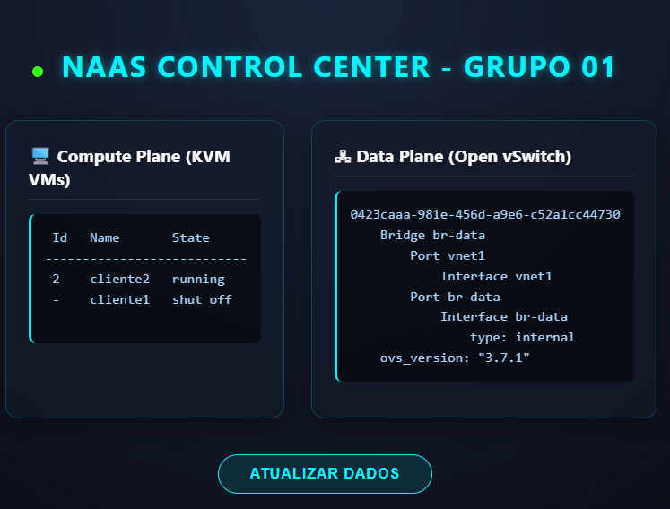

<p align="center">
  
</p>

# Documentação de Execução: Laboratório de Paravirtualização e Redes (NaaS)

## 📌 Sumário
1. [Objetivo do Documento](#1-objetivo-do-documento)
2. [Arquivos e Ferramentas do Repositório](#2-arquivos-e-ferramentas-do-repositório)
3. [Ambiente de Execução](#3-ambiente-de-execução)
4. [Memorial Descritivo de Comandos e Respostas](#4-memorial-descritivo-de-comandos-e-respostas)
5. [Como Apresentar (Ferramentas Gráficas e Testes)](#5-como-apresentar-ferramentas-gráficas)
    - [5.1. Dashboard Web Interativo](#51-dashboard-web-interativo-opcional-porém-impressionante)
    - [5.2. Script Interativo de Terminal](#52-script-interativo-de-terminal)
    - [5.3. Roteiro de Testes ao Vivo](#53-roteiro-de-testes-ao-vivo-simulação-de-falhas)

---

## 1. Objetivo do Documento
Este relatório técnico descreve os passos exatos executados para a construção do protótipo exigido no seminário sobre Virtualização Nativa e Paravirtualização. O laboratório demonstra o uso de um hypervisor Linux (KVM) atuando sobre Windows via WSL 2, integrado a um switch virtual (Open vSwitch) e máquinas virtuais utilizando drivers paravirtualizados de Entrada/Saída (virtio).

## 2. Arquivos e Ferramentas do Repositório
*   `README.md`: Este documento principal com o registro acadêmico e técnico.
*   `docs/guia_pratico_entrega.md`: Guia teórico com diagrama de arquitetura e justificativas do projeto.
*   `roteiro_testes_ao_vivo.md`: Roteiro com comandos de simulação de falhas para a apresentação.
*   `demo_apresentacao.sh`: Script executável de terminal para apresentação interativa dos resultados.
*   `dashboard.py`: Servidor Web em Python que gera uma interface gráfica (Dashboard) em tempo real da infraestrutura.

---

## 3. Ambiente de Execução
*   **Host Físico:** Windows 11 com suporte a Virtualização Assistida por Hardware (Intel VT-x / AMD-V).
*   **Hypervisor Level 1 (Emulação Nativa):** Windows Subsystem for Linux 2 (WSL 2) executando Ubuntu 24.04 LTS.
*   **Hypervisor Level 2 (KVM):** QEMU/KVM rodando sobre o kernel do WSL 2.
*   **Sistema Operacional Convidado (Guest):** CirrOS 0.6.2 (Distribuição Linux mínima).

---

## 4. Memorial Descritivo de Comandos e Respostas

### 4.1. Preparação da Infraestrutura Base
O primeiro passo consiste em provisionar o ambiente Linux que atuará como o servidor físico do provedor.

**Comando:**
```powershell
wsl --install -d Ubuntu
```
**Explicação Técnica:** Utiliza o recurso nativo do Windows para instanciar uma máquina virtual leve sob o hypervisor Hyper-V. Isso provê um kernel Linux real, necessário para a execução do módulo KVM.
**Resposta Esperada:** Download da distribuição e solicitação de criação de credenciais UNIX.

### 4.2. Instalação dos Pacotes do Hypervisor e Switch Virtual
No terminal do Ubuntu, procede-se com a instalação das ferramentas de gerência, emulação e comutação de rede.

**Comando:**
```bash
sudo apt update
sudo apt install -y qemu-system-x86 libvirt-daemon-system libvirt-clients bridge-utils virtinst openvswitch-switch wget
```
**Explicação Técnica:**
*   `qemu-system-x86`: Fornece a camada de emulação de hardware subjacente ao KVM.
*   `libvirt-daemon-system` / `libvirt-clients`: API (Application Programming Interface) e serviços (virsh) para gerenciamento de hypervisors.
*   `openvswitch-switch`: Switch virtual multicamadas focado em ambientes de Data Center (SDN/NaaS).
*   `virtinst`: Ferramentas de linha de comando para provisionamento de VMs (`virt-install`).

### 4.3. Configuração de Permissões e Inicialização de Serviços
**Comando:**
```bash
sudo usermod -aG libvirt $USER
sudo usermod -aG kvm $USER
sudo service libvirtd start
sudo service openvswitch-switch start
```
**Explicação Técnica:** Adiciona o usuário do sistema aos grupos de controle da virtualização para evitar restrições de permissão nos sockets. Em seguida, inicia o daemon do libvirt e o daemon do Open vSwitch.
**Resposta Esperada:** Retorno silencioso (indicando sucesso nas adições de grupo) e mensagens de inicialização dos daemons: ` * Starting libvirt management daemon libvirtd  [ OK ]`.

### 4.4. Criação do Data Plane (Isolamento de Tráfego)
A arquitetura do provedor exige o isolamento do tráfego das máquinas virtuais do tráfego de gerência.

**Comando:**
```bash
sudo ovs-vsctl add-br br-data
```
**Explicação Técnica:** Instancia uma bridge virtual (`br-data`) na memória do Open vSwitch. Esta bridge atuará como a rede isolada dos clientes (Data Plane).

**Comando:**
```bash
cat <<EOF > ovs-network.xml
<network>
  <name>ovs-network</name>
  <forward mode='bridge'/>
  <bridge name='br-data'/>
  <virtualport type='openvswitch'/>
</network>
EOF
sudo virsh net-define ovs-network.xml
sudo virsh net-start ovs-network
sudo virsh net-autostart ovs-network
```
**Explicação Técnica:** Cria um descritor XML para que a API do `libvirt` compreenda a existência da bridge OVS recém-criada e a mapeie como uma rede de virtualização disponível para as VMs.
**Resposta Esperada:**
```text
Network ovs-network defined from ovs-network.xml
Network ovs-network started
Network ovs-network marked as autostarted
```

### 4.5. Preparação da Imagem do Guest OS
**Comando:**
```bash
wget https://download.cirros-cloud.net/0.6.2/cirros-0.6.2-x86_64-disk.img
cp cirros-0.6.2-x86_64-disk.img cliente1.img
cp cirros-0.6.2-x86_64-disk.img cliente2.img
```
**Explicação Técnica:** Obtém a imagem de disco QCOW2 padrão do sistema operacional CirrOS e realiza a cópia para atuar como o disco rígido independente de cada máquina virtual.
**Resposta Esperada:**
```text
--2026-05-21 22:00:47--  https://download.cirros-cloud.net/0.6.2/cirros-0.6.2-x86_64-disk.img
Resolving download.cirros-cloud.net (download.cirros-cloud.net)... 69.163.176.183, 2607:f298:6:a014::c3e:9bd6
Connecting to download.cirros-cloud.net (download.cirros-cloud.net)|69.163.176.183|:443... connected.
HTTP request sent, awaiting response... 302 Found
Location: https://github.com/cirros-dev/cirros/releases/download/0.6.2/cirros-0.6.2-x86_64-disk.img [following]
...
HTTP request sent, awaiting response... 200 OK
Length: 21430272 (20M) [application/octet-stream]
Saving to: ‘cirros-0.6.2-x86_64-disk.img’

cirros-0.6.2-x86_64-disk.img         100%[============================================================================>]  20.44M  25.2MB/s    in 0.8s    

2026-05-21 22:00:50 (25.2 MB/s) - ‘cirros-0.6.2-x86_64-disk.img’ saved [21430272/21430272]
```

### 4.6. Provisionamento com Paravirtualização (O Core da Entrega)
Este é o ponto fundamental do seminário, onde o conceito de paravirtualização é aplicado tecnicamente.

**Comando:**
```bash
sudo virt-install \
  --name cliente1 \
  --ram 256 \
  --vcpus 1 \
  --disk path=cliente1.img,format=qcow2,bus=virtio \
  --network network=ovs-network,model=virtio \
  --os-variant generic \
  --import \
  --noautoconsole
```
*(O comando é repetido para o `cliente2` mudando o nome e o disco).*

**Explicação Técnica:** O parâmetro `bus=virtio` para o disco rígido e `model=virtio` para a placa de rede instruem o KVM a NÃO emular hardwares legados (como controladoras IDE ou placas de rede Intel e1000/Realtek). Em vez disso, o hypervisor insere um barramento virtual focado em performance. O sistema operacional convidado, ciente da virtualização (Guest OS Aware), utiliza os drivers paravirtualizados para se comunicar diretamente com o host via anéis de memória compartilhada (Ring Buffers). Isso reduz expressivamente a transição de contexto (context switching) e diminui a latência em cenários NaaS de alto tráfego.
**Resposta Esperada:**
```text
WARNING  Using --osinfo generic, VM performance may suffer. Specify an accurate OS for optimal results.

Starting install...
Creating domain...                                                                                                                   |         00:00:00     
Domain creation completed.
```

### 4.7. Validação Técnica do Protótipo
Os seguintes comandos são executados para atestar o pleno funcionamento do ambiente.

**Validação 1: Isolamento de Rede**
**Comando:** `sudo ovs-vsctl show`
**Explicação:** Lista a topologia atual do switch virtual.
**Resposta Esperada:** 
```text
0423caaa-981e-456d-a9e6-c52a1cc44730
    Bridge br-data
        Port vnet0
            Interface vnet0
        Port vnet1
            Interface vnet1
        Port br-data
            Interface br-data
                type: internal
    ovs_version: "3.7.1"
```
A saída demonstra a `Bridge br-data` contendo as portas `vnet0` (VM1) e `vnet1` (VM2). Isso comprova que o tráfego das duas VMs está encapsulado sob o Open vSwitch, completamente isolado da interface primária do host Ubuntu (Management Plane).

**Validação 2: Uso dos Drivers Paravirtualizados**
**Comando:** `sudo virsh console cliente1`
**Explicação:** Acessa o console serial do cliente. Após o login, executa-se a inspeção nativa de hardware da interface de rede.
**Comando Interno na VM:** `cat /sys/class/net/eth0/device/uevent`
**Resposta Esperada:**
```text
DRIVER=virtio_net
MODALIAS=virtio:d00000001v00001AF4
```
**Conclusão Técnica:** A presença de `DRIVER=virtio_net` atesta cabalmente que a máquina virtual está executando paravirtualização de rede em vez de depender de emulação completa.

---

## 5. Como Apresentar (Ferramentas Gráficas)

Para facilitar a apresentação do trabalho ao vivo, este repositório conta com duas ferramentas interativas:

### 5.1. Dashboard Web Interativo (Opcional, porém impressionante)
Foi desenvolvido um dashboard em Python/HTML com design moderno (Glassmorphism e Neon) que consulta o Host e renderiza o status do isolamento de rede e das VMs em tempo real.
**Como iniciar:**
No terminal do Linux (WSL), digite:
```bash
sudo python3 dashboard.py
```
Em seguida, abra o navegador do seu Windows (Chrome, Edge, etc) e acesse:
**`http://localhost:8080`**

### 5.2. Script Interativo de Terminal
Caso prefira uma abordagem "hacker" diretamente no terminal, execute o script de apresentação. Ele formata as saídas com cores e pausas dramáticas.
**Como iniciar:**
```bash
chmod +x demo_apresentacao.sh
./demo_apresentacao.sh
```
Aperte a tecla `ENTER` passo a passo para evoluir a demonstração.

### 5.3. Roteiro de Testes ao Vivo (Simulação de Falhas)
Para coroar a apresentação e garantir a nota máxima pela dinamicidade da infraestrutura (NaaS), foi desenvolvido um roteiro de estresse do ambiente.
Este documento auxiliar contém comandos como `suspend`, `start`, `destroy` para serem aplicados no hypervisor, fazendo o Dashboard reagir em tempo real.

📄 **[Acesse o roteiro completo aqui: roteiro_testes_ao_vivo.md](roteiro_testes_ao_vivo.md)**
