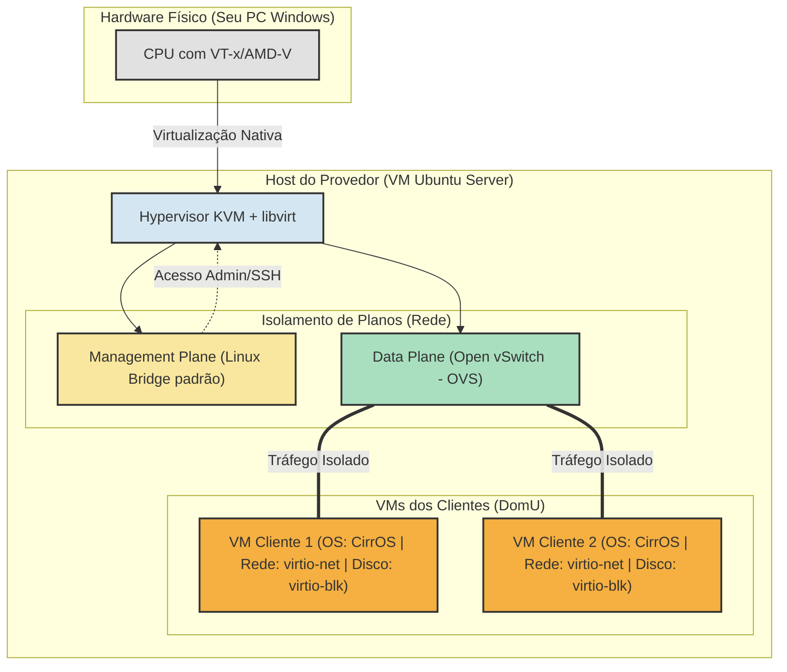

# Guia Prático para Entrega do Seminário

Este documento contém tudo o que você precisa para **entregar e apresentar** o seu trabalho de infraestrutura de redes de forma simples, direta e com alto impacto técnico. 

A estratégia mais simples e eficiente para simular esse ambiente sem precisar de múltiplos servidores físicos é usar **Virtualização Aninhada (Nested Virtualization)**. Você usará o seu próprio computador (Windows) para rodar uma VM Linux que atuará como o "Servidor Físico do Provedor" (Hypervisor KVM). Dentro desse Linux, você criará as VMs dos clientes.

---

## 1. Diagrama de Arquitetura (Topologia Lógica)

Utilize o diagrama abaixo na sua apresentação para ilustrar a separação entre o plano de gerência e o plano de dados (exigência do trabalho), e onde a paravirtualização atua.



---

## 2. Justificativa Técnica (Para o Slide/Relatório)

**Por que escolhemos KVM com drivers VirtIO em vez de Xen?**
Para um provedor regional que busca consolidar serviços, adotamos uma abordagem híbrida: a **Virtualização Nativa (Assistida por Hardware)** via KVM para abstrair CPU/Memória com performance bare-metal, combinada com a **Paravirtualização de E/S (I/O)** utilizando drivers **VirtIO**.
Essa escolha elimina o gargalo de emulação de hardware (ex: QEMU emulando uma placa de rede Realtek), reduzindo drasticamente a latência de rede e uso de CPU, tornando a infraestrutura pronta para serviços de alta vazão (NaaS), com menor complexidade de gerenciamento em comparação à arquitetura baseada em Dom0 do Xen.

---

## 3. Roteiro do Protótipo (Passo a Passo Simplificado)

Para não pesar o seu computador, usaremos **CirrOS** (um sistema Linux minúsculo, de ~20MB, feito exatamente para testes em nuvem) nas VMs dos clientes.

### Pré-requisitos (No seu PC Windows)
1. Instale o **VirtualBox** ou **VMware Player**.
2. Crie uma VM com **Ubuntu Server 22.04 ou 24.04**.
3. **MUITO IMPORTANTE:** Nas configurações do processador da VM no VirtualBox/VMware, marque a opção **"Habilitar VT-x/AMD-V aninhado" (Nested Virtualization)**. Dê a essa VM pelo menos 4GB de RAM e 2 CPUs.

### Passo 1: Preparando o Hypervisor (Dentro do Ubuntu)
Acesse o seu Ubuntu Server e instale o KVM, o gerenciador Libvirt e o Open vSwitch:
```bash
# Atualiza os pacotes
sudo apt update

# Instala o KVM, Libvirt, utilitários e o Open vSwitch
sudo apt install -y qemu-system-x86 libvirt-daemon-system libvirt-clients bridge-utils virtinst openvswitch-switch wget

# Adiciona seu usuário ao grupo do KVM
sudo usermod -aG libvirt $USER
sudo usermod -aG kvm $USER
```
*(Dica: Faça logoff e login novamente no Ubuntu para aplicar os grupos).*

### Passo 2: Criando a Rede de Dados (Data Plane com OVS)
Vamos criar o switch virtual que fará o isolamento do tráfego dos clientes:
```bash
# Cria uma bridge no Open vSwitch
sudo ovs-vsctl add-br br-data

# Define a rede no Libvirt associada a essa bridge OVS
cat <<EOF > ovs-network.xml
<network>
  <name>ovs-network</name>
  <forward mode='bridge'/>
  <bridge name='br-data'/>
  <virtualport type='openvswitch'/>
</network>
EOF

# Aplica a rede
sudo virsh net-define ovs-network.xml
sudo virsh net-start ovs-network
sudo virsh net-autostart ovs-network
```

### Passo 3: Criando as VMs Paravirtualizadas
Baixe a imagem do CirrOS e inicie as VMs garantindo o uso do `virtio`:
```bash
# Baixa a imagem do CirrOS
wget https://download.cirros-cloud.net/0.6.2/cirros-0.6.2-x86_64-disk.img

# Cria a VM do Cliente 1 (Observe o uso do modelo virtio para rede e disco)
sudo virt-install \
  --name cliente1 \
  --ram 256 \
  --vcpus 1 \
  --disk path=cirros-0.6.2-x86_64-disk.img,format=qcow2,bus=virtio \
  --network network=ovs-network,model=virtio \
  --os-variant generic \
  --import \
  --noautoconsole

# Faça uma cópia do disco para o cliente 2
cp cirros-0.6.2-x86_64-disk.img cliente2-disk.img

# Cria a VM do Cliente 2
sudo virt-install \
  --name cliente2 \
  --ram 256 \
  --vcpus 1 \
  --disk path=cliente2-disk.img,format=qcow2,bus=virtio \
  --network network=ovs-network,model=virtio \
  --os-variant generic \
  --import \
  --noautoconsole
```

### Passo 4: O Que Mostrar na Apresentação? (O "Gran Finale")

Durante a apresentação do seminário, abra o terminal do Ubuntu e mostre os seguintes comandos para provar que você atendeu a todos os requisitos:

**1. Provar o Isolamento (Data Plane vs Management Plane):**
Mostre as interfaces conectadas ao Open vSwitch.
```bash
sudo ovs-vsctl show
```
*Você mostrará que o tráfego dos clientes está passando pelo switch virtual `br-data`, enquanto a sua conexão SSH no Ubuntu está usando a interface padrão.*

**2. Provar o uso de Paravirtualização de E/S (Otimização de Latência):**
Acesse o console de uma das VMs clientes:
```bash
sudo virsh console cliente1
```
*(Aperte Enter. O login do CirrOS é usuário: `cirros`, senha: `gocubsgo`)*.
Dentro do cliente, digite:
```bash
ethtool -i eth0
```
*Mostre para a turma e o professor que o campo "driver" diz **`virtio_net`**. Isso comprova que a VM está usando um driver paravirtualizado diretamente conectado ao host, em vez de uma placa de rede emulada (que geraria overhead).*

Para sair do console da VM e voltar ao Ubuntu, pressione `Ctrl + ]`.
